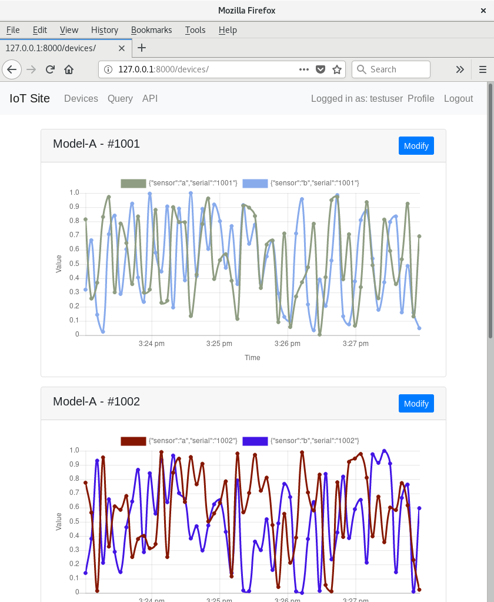
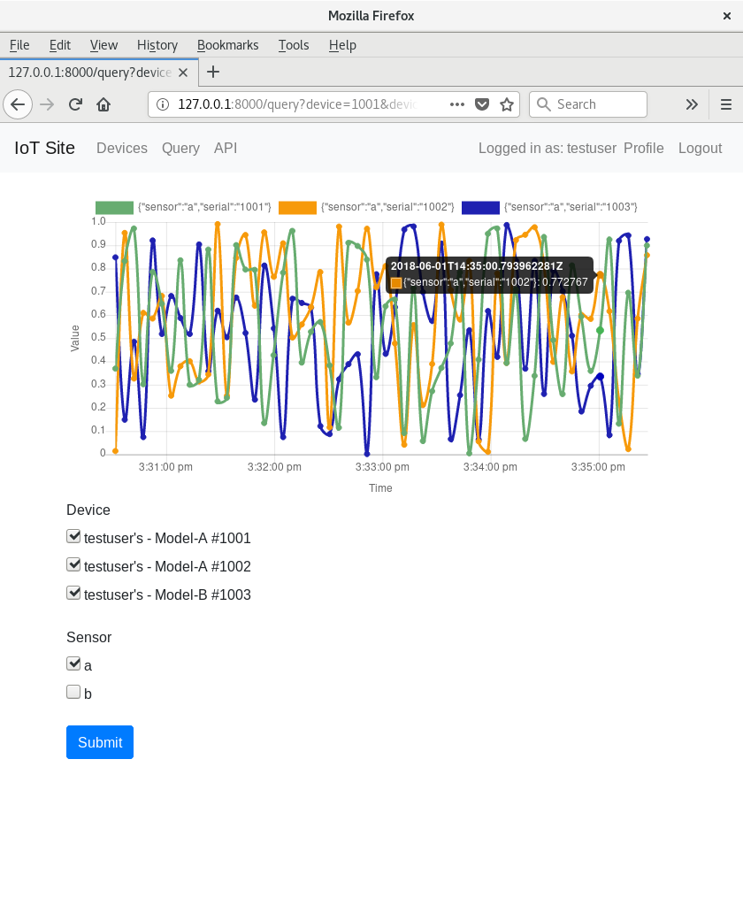

# Demo IoT Stack

The stack is seperated into two parts: the "control plane" (`iot_site`) and the "data plane" (`device_endpoint`).

## iot_site

This is the user facing website for managing the devices.

* Django 2.x
* Bootstrap 4
* Django REST Framework

## device_endpoint

Metrics from the devices are sent here. For the demo we forward them to a local InfluxDB instance.

* aiohttp

Seperating this from the site allows the site to be upgraded independently without downtime to the device endpoint. It also allows a [scalable](https://en.wikipedia.org/wiki/C10k_problem) async server to be used.

## test_device

This simulates multiple devices sending metrics to the endpoint.

* shell+curl

# Reference

* [Django Tutorial](https://docs.djangoproject.com/en/2.0/intro/tutorial01/)
* [Django REST Framework Quickstart](http://www.django-rest-framework.org/tutorial/quickstart/)
* [Django REST Framework Tutorial](http://www.django-rest-framework.org/tutorial/1-serialization/)
* [Python Packaging Tutorial](https://python-packaging.readthedocs.io/)
